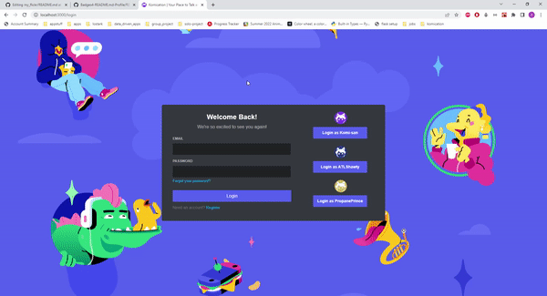
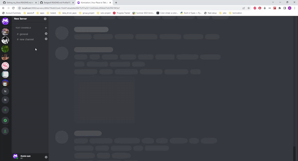
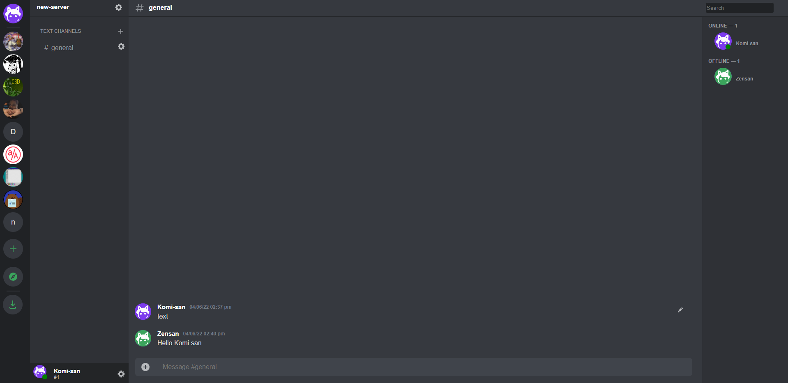

# Komication

komication Live Link: https://komication.herokuapp.com/

Git wiki: https://github.com/arasargsyan0622/Komication/wiki

### Contact

<div>Vernyoon Chao
   <a href="https://www.linkedin.com/in/vernyoon-chao-783494123/"></a>
   <a href="https://github.com/VernyoonChao98"></a>
</div>

<div>Chris Treadgill
<a href="https://www.linkedin.com/in/chris-threadgill-b05090185/"></a>
<a href="https://github.com/ChrisThreadgill"></a>
</div>

<div>Darren Kong
<a href="https://www.linkedin.com/in/darren-kong-06b47013b/"></a>
<a href="https://github.com/dkong1321"></a>
</div>

<div>Ara Sargsyan
<a href="https://www.linkedin.com/in/ara-sargsyan-9a8a07237/"></a>
<a href="https://github.com/arasargsyan0622"></a>
</div>

## komication

---

Komication

Komication is a Full Stack Discord clone. It is a place to talk and hang out with your friends. Users can create servers, channels, channel and direct messaging.

## Getting started

1. Clone this repository

   ```bash
   git clone https://github.com/arasargsyan0622/Komication.git
   ```

2. Install dependencies

   ```bash
   pipenv install
   ```

   ```bash
   cd react-app
   ```

   ```bash
   npm install
   ```

3. Create a **.env** file based on the example with proper settings for your
   development environment

4. Setup your PostgreSQL user, password and database and make sure it matches your **.env** file

5. Get into your pipenv, migrate your database, seed your database, and run your flask app

   ```bash
   pipenv shell
   ```

   ```bash
   flask db upgrade
   ```

   ```bash
   flask seed all
   ```

   ```bash
   flask run
   ```

6. To run the React App in development

   ```bash
   cd react-app
   ```

   ```bash
   npm start
   ```

---

## Technologies Used

---


## Features

The User can create servers. When a server is created, a "General" channel is created automatically. The server owner can also create, edit and delete channels. There is a live chat in channels where users who are invited to that server, can chat with each other. Message owners can edit or delete their messages. Direct messaging is similar to channel's chat. Lastly, Server owners can also edit the server name or delete them.

##

### Login and Sign-up

Account registration and login are fully functional and error handled.

Login Page



Signup Page


### Splash page


### Servers CRUD

Server creation is a modal. The user can give a server name and upload an image. A user can also join a server with an invitation link. To save an edit, the user has to click on "Save Changes". In order to Delete a server, the user has to type in the server name.

Create a Server


Edit/Delete a Server


Join a server


### Channels CRUD

Channel creation is a modal. The user can give a channel name.

Create a Channel


Edit/Delete a Channel



### Channel Messages CRUD

Channel chat is a live chat where people can talk to each other. Message owner can edit or delete their messages by clicking the "pencil" icon.

Create/Read a Message



Edt/Delete a Message


<!-- Direct messages here -->

## Future Features

---

- Implement profile page.
- Implement a search feature to search for messages.

<!-- ## Getting started
1. Clone this repository (only this branch)

   ```bash
   git clone https://github.com/appacademy-starters/python-project-starter.git
   ```

2. Install dependencies

      ```bash
      pipenv install --dev -r dev-requirements.txt && pipenv install -r requirements.txt
      ```

3. Create a **.env** file based on the example with proper settings for your
   development environment
4. Setup your PostgreSQL user, password and database and make sure it matches your **.env** file

5. Get into your pipenv, migrate your database, seed your database, and run your flask app

   ```bash
   pipenv shell
   ```

   ```bash
   flask db upgrade
   ```

   ```bash
   flask seed all
   ```

   ```bash
   flask run
   ```

6. To run the React App in development, checkout the [README](./react-app/README.md) inside the `react-app` directory.

***


*IMPORTANT!*
   psycopg2-binary MUST remain a dev dependency because you can't install it on alpine-linux.
   There is a layer in the Dockerfile that will install psycopg2 (not binary) for us.
***

### Dev Containers (OPTIONAL for M1 Users)
The following instructions detail an *optional* development setup for M1 Mac users having issues with the `psycopg` package.

1. Make sure you have the [Microsoft Remote - Containers](https://marketplace.visualstudio.com/items?itemName=ms-vscode-remote.remote-containers) extension installed.
2. Make sure you have [Docker](https://www.docker.com/products/docker-desktop/) installed on your computer.
3. Clone the repository (only this branch)
   ```bash
   git clone https://github.com/appacademy-starters/python-project-starter.git
   ```
4. Open the repo in VS Code.
5. Click "Open in Container" when VS Code prompts to open container in the bottom right hand corner.
6. **Be Patient!** The initial install will take a LONG time, it's building a container that has postgres preconfigured and even installing all your project dependencies. (For both flask and react!)

   **Note:** This will take much less time on future starts because everything will be cached.

7. Once everything is up, be sure to make a `.env` file based on `.env.example` in both the root directory and the *react-app* directory before running your app. You do not need a `DATABASE_URL` in the `.env` file if you are using this Docker setup for development - the URL is already set in the image (see `.devcontainer/Dockerfile` for the URL).

8. Get into your pipenv, migrate your database, seed your database, and run your flask app

   ```bash
   pipenv shell
   ```

   ```bash
   flask db upgrade
   ```

   ```bash
   flask seed all
   ```

   ```bash
   flask run
   ```

9. To run the React App in development, checkout the [README](./react-app/README.md) inside the `react-app` directory.

<br>

## Deploy to Heroku
This repo comes configured with Github Actions. When you push to your main branch, Github will automatically pull your code, package and push it to Heroku, and then release the new image and run db migrations.

1. Write your Dockerfile. In order for the Github action to work effectively, it must have a configured Dockerfile. Follow the comments found in this [Dockerfile](./Dockerfile) to write your own!

2. Create a new project on Heroku.

3. Under Resources click "Find more add-ons" and add the add on called "Heroku Postgres".

4. Configure production environment variables. In your Heroku app settings -> config variables you should have two environment variables set:

   |    Key          |    Value    |
   | -------------   | ----------- |
   | `DATABASE_URL`  | Autogenerated when adding postgres to Heroku app |
   | `SECRET_KEY`    | Random string full of entropy |

5. Generate a Heroku OAuth token for your Github Action. To do so, log in to Heroku via your command line with `heroku login`. Once you are logged in, run `heroku authorizations:create`. Copy the GUID value for the Token key.

6. In your Github Actions Secrets you should have two environment variables set. You can set these variables via your Github repository settings -> secrets -> actions. Click "New respository secret" to create
each of the following variables:

   |    Key            |    Value    |
   | -------------     | ----------- |
   | `HEROKU_API_KEY`  | Heroku Oauth Token (from step 6)|
   | `HEROKU_APP_NAME` | Heroku app name    |

7. Push to your `main` branch! This will trigger the Github Action to build your Docker image and deploy your application to the Heroku container registry. Please note that the Github Action will automatically upgrade your production database with `flask db upgrade`. However, it will *not* automatically seed your database. You must manually seed your production database if/when you so choose (see step 8).

8. *Attention!* Please run this command *only if you wish to seed your production database*: `heroku run -a HEROKU_APP_NAME flask seed all`

## Helpful commands
|    Command            |    Purpose    |
| -------------         | ------------- |
| `pipenv shell`        | Open your terminal in the virtual environment and be able to run flask commands without a prefix |
| `pipenv run`          | Run a command from the context of the virtual environment without actually entering into it. You can use this as a prefix for flask commands  |
| `flask db upgrade`    | Check in with the database and run any needed migrations  |
| `flask db downgrade`  | Check in with the database and revert any needed migrations  |
| `flask seed all`      | Just a helpful syntax to run queries against the db to seed data. See the **app/seeds** folder for reference and more details |
| `heroku login -i`      | Authenticate your heroku-cli using the command line. Drop the -i to authenticate via the browser |
| `heroku authorizations:create` | Once authenticated, use this to generate an Oauth token |
| `heroku run -a <app name>` | Run a command from within the deployed container on Heroku | -->
